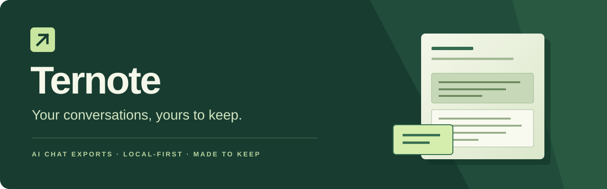

<div align="center">



**Turn useful AI conversations into documents worth keeping.**

Save the explanation. Keep the code. Take the ideas with you.


[Try the development build](#-try-ternote) · [Features](#-from-chat-to-something-you-can-use) · [Roadmap](Test.md) · [Privacy](PRIVACY.md) · [GitHub](https://github.com/Anson-Saju-George/Ternote)

</div>

---

## 🌿 Meet Ternote

Ternote is a local-first browser extension for turning AI conversations into readable, portable documents. A small **Export** button keeps the chat interface uncluttered. Choose your messages, pick a format, preview the result, and save it.

Built for the study notes, debugging sessions, research and ideas you want to return to—not leave buried in a chat sidebar.

> **Chrome Web Store release planned.** Ternote is currently an early development build, not a published store extension. You can build and load it locally today. Store installation will be linked here once it is available.

## ✨ From chat to something you can use

| | What you can do today |
| :--- | :--- |
| **📄 Download a real PDF** | Preview the actual document, then download it directly. No print dialog. |
| **🖼 Keep images in context** | Bordered image and attachment cards follow the conversation. Images and messages share page space when they fit. |
| **🎨 Choose your page style** | Light and dark export themes, clear speaker labels, readable code and structured tables. |
| **✂️ Export what matters** | Capture the conversation, filter by speaker, or choose individual messages. |
| **⏳ Work through longer chats** | Incremental loading, progress updates and cancellation, with warnings when content may be unavailable. |
| **🧰 Pick your format** | PDF, Markdown, HTML, plain text, JSON or CSV. |
| **📝 Keep useful context** | Optional conversation metadata, custom filenames and literal text redaction. Model and effort values appear only when exposed by the page. |

Accessible images, attached PDF pages, DOCX content, reflowed PPTX slide content and common text files can be included in PDF and HTML exports, at their place in the conversation. Use **Attachments** to choose detected file types, with a separate image toggle. PPTX originals remain available through **Save original**.

Native PPTX original downloading has been confirmed by the owner in ChatGPT. Inline slide content and attachment selection are the next visual-review checkpoint; this is not a claim of PowerPoint-perfect rendering or universal file support.

### Platform progress

| Platform | Current status |
| :--- | :--- |
| **ChatGPT** | Primary development and manual-testing focus; UI, image export and current PDF layout approved by the project owner. Native attachment support remains incomplete. |
| **Claude** | Initial adapter and synthetic tests exist; broader live-site validation is pending. |
| **Gemini** | Initial adapter and synthetic tests exist; broader live-site validation is pending. |

AI websites change. These statuses describe development progress, not a guarantee that every conversation or platform feature is supported.

## 🔒 Your conversations stay on your device

- **No Ternote account or backend.** The current extension processes chats and documents in your browser.
- **No analytics or ad SDK.** No chat text is uploaded to a Ternote service.
- **Site access is your choice.** Enable individual supported platforms instead of granting access to every website.
- **No permanent chat archive by default.** Captured content stays in memory for the export view; preferences are saved locally. Downloaded files remain yours to manage.
- **Bundled document tools.** Conversion libraries and fonts ship with the extension; executable code is not loaded remotely.

Loading a conversation or fetching its attachments can still contact the chat platform. Local-first means Ternote does not send your chat to a separate conversion service—not that the browser never uses the network. Read the [privacy details](PRIVACY.md).

## 💚 Why I built this

I wanted a simple way to keep the useful things I create with AI: explanations, code, study material and entire conversations. Saving my own work should not mean juggling screenshots, cleaning up broken formatting, or hitting a paywall for basic exports.

So I started Ternote: a focused exporter with a clean interface, local processing and useful documents at the end. My goal is a free, openly developed tool that feels good to use and respects the conversations entrusted to it.

— **[Anson Saju George](https://github.com/Anson-Saju-George)**

## 🚀 Try Ternote

For now, Ternote is installed as an **unpacked development extension**. Normal Edge is the current manual-testing workflow; a Chrome Web Store release is planned after validation and release review.

### 1. Build locally

Use **Node.js 24 or newer** and npm.

```bash
git clone https://github.com/Anson-Saju-George/Ternote.git
cd Ternote
npm ci --ignore-scripts
npm run check
npm test
npm run build
```

### 2. Load the extension

1. Open `edge://extensions` in your normal Edge profile. For Chrome development testing, use `chrome://extensions`.
2. Enable **Developer mode** and choose **Load unpacked**.
3. Select the generated **dist** folder—not the repository root.
4. Open Ternote and enable access only for the platforms you want to use.

### 3. Save a conversation

Open a supported chat → click **Export** → choose messages, format and theme → **Preview** → **Export conversation**.

Keep the export view open while it works. After rebuilding, reload the extension from your browser's extensions page and refresh the chat tab.

## 🧭 What comes next

The next priorities are live review of inline attachments and type selection, broader file-card coverage, more reliable capture and reusable caching. Expanded settings, a saved library, additional formats and batch export follow in separate, testable steps.

See the **[17-phase roadmap and acceptance checklist](Test.md)** for the full plan. Planned features are not advertised as already available.

<details>
<summary><strong>Current limitations — worth knowing before you export</strong></summary>

- Reaching both visible scroll boundaries does not prove that a platform exposed its complete server-side history. Review completeness warnings.
- Expired, protected or card-only attachments may be unavailable. The extension reports missing files rather than pretending they were included.
- Attached PDFs are rendered as images of their pages; their original text is not searchable in the combined PDF. DOCX content is reflowed, not reproduced with Word-perfect layout.
- PPTX text, tables and embedded raster images are reflowed in slide order. Original positioning, themes, master-slide content, notes, shapes, charts, SmartArt, media and animations are not reproduced. Keep the original for full fidelity.
- TXT, Markdown, CSV, JSON, HTML, XML, YAML, logs and supported code files are displayed as inert text/source. Excel, legacy `.doc`/`.ppt`, and embedded original-file bundles are not implemented.
- Complex equations, merged tables, some writing systems and platform-specific artifacts still need fidelity work.
- Exact-text redaction cannot safely remove text from image pixels. Images and attached PDF pages are omitted when it is enabled.
- Browser memory is finite. Explicit safety limits apply; there is no promise of unlimited file sizes or flawless capture of every chat.

The [technical notes](Ternote.md) document the current limits in more detail.

</details>

## 🛠 Built in the open

Ternote uses Manifest V3, JavaScript modules, locally bundled PDF/document libraries and automated regression tests. Changes are developed in small checkpoints, visually reviewed, then committed and pushed.

```bash
npm run check          # Syntax and permission checks
npm test               # Unit and security regression tests
npm run build          # Generate the unpacked extension
npm run test:browser   # Isolated browser integration tests
npm run package        # Development ZIP and SHA-256 sidecar
```

Browser tests use an isolated profile; they do not use your normal browsing profile. See [development status](docs/STATUS.md), [security](SECURITY.md) and [third-party dependencies](docs/DEPENDENCIES.md).

### Feedback

Found a formatting problem or missing attachment? [Open an issue](https://github.com/Anson-Saju-George/Ternote/issues) with the platform, browser, format and a minimal synthetic example. **Do not post private conversations, signed file URLs or authentication details.** Follow [SECURITY.md](SECURITY.md) for security-reporting guidance.

### License and affiliation

The repository is public, but the original project is currently **UNLICENSED** while the owner selects its public license. A public repository is not, by itself, an open-source license. Third-party components retain their own licenses.

Ternote is an independent project, not affiliated with or endorsed by OpenAI, Anthropic, Google or Microsoft. Platform names and marks belong to their respective owners.

---

<div align="center">

**Keep the conversation. Make room for the next idea.**

Built by [Anson Saju George](https://github.com/Anson-Saju-George) · [Explore the roadmap](Test.md) · [Star Ternote](https://github.com/Anson-Saju-George/Ternote)

</div>
